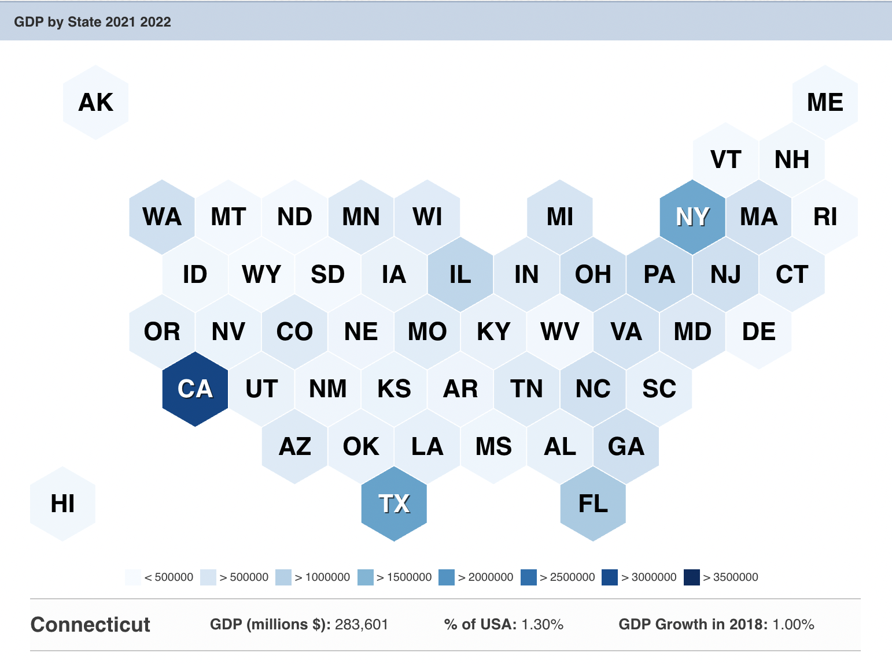
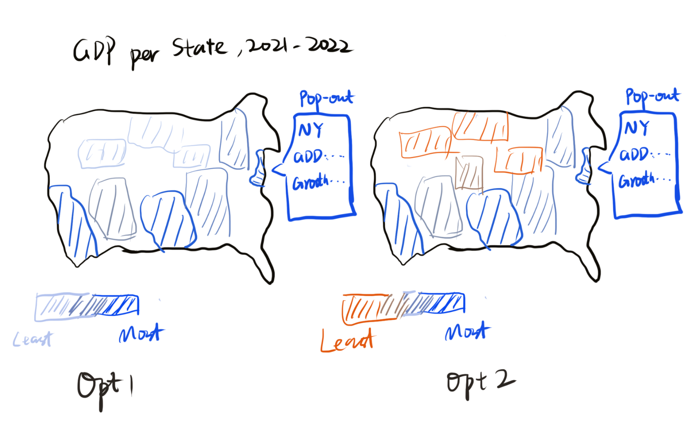
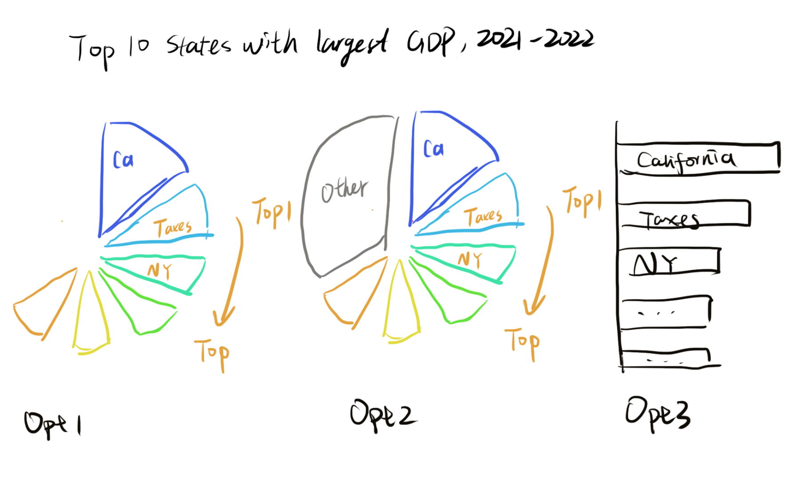

# GDP by State, 2021-2022

## Original Data Visulizaition
[World Population Review](https://worldpopulationreview.com/state-rankings/gdp-by-state) produced a data visulization on GDP per state in 2021-2022. The review was to introduce GDP and what GDP means in an economic entity, and highlight the top 10 states in US with the largest GDP number. The map is consit of lots of hex pieces, where each piece is representing one state. The 2-letter state name is labeled on the hex piece. Darker color is representing larger GDP. The label below the graph will change according to where your monse is on a single hex piece. 

## Wireframe
In the first wireframe, I redesigned the map graph and, decide to use real US map instead of hex ones. The change can provide a more straight and vivid view linking the numbers to the state. It is easier to think about the numbers together with the states, including where the state is (east, west or middle), how big is the state area, is state a border state or an inland state, etc.

Initially, I was thinking about two options, which follows different color themes. In the left option, all colors are blue, but the states with higher GDP get darker color. In the right option, the color becomes from dark blue to dark orange.

In the second wireframe, I tend to highlight top 10 states with largest GDP. I thought of two chart type, pie chart and bar chart. Pie chart is good for presenting the percentage a state contributes to the country GDP, while bar chart is good for presenting ranking and absolute amount. To highlight top 10, I will combine the rest states as a whole, called others. 

## FeedBack

Interview 1:
- Can you tell me what you think this is?
This is very straight forward to understand, this is GDP by State, as the title suggests. 

- Is there anything you find surprising or confusing?
Not really, they are simple and staright forward.

- Which color scheme do you prefer (all blue vs blue/orange)?
All blues are great. But it could be better to highlight the top 10.

- Do you prefer pie or bar chart when it comes to top 10 countries.
Pie, it tells the percentage. I believe percentage makes more sense.

- Who do you think is the intended audience for this?
This might be for students who is studying economics and currently doing an research. 

- Is there anything you would change or do differently?
The title can includs more information. 

Interview 2:
- Can you tell me what you think this is?
GDP by State, Top states stats.

- Is there anything you find surprising or confusing?
No, quite clear.

- Which color scheme do you prefer (all blue vs blue/orange)?
Try blue/orange if you want your audience to look at both top and bottom. Otherwise use all blue to only highlight top ones.

- Do you prefer pie or bar chart when it comes to top 10 countries.
Why not try both, because they are telling different things, and usually the audience want to look at both.

- Who do you think is the intended audience for this?
Might be students or economic researchers. 

- Is there anything you would change or do differently?
Put label and legend at a good place. 

## Final Visualization

[Back to Main Page](/README.md)
