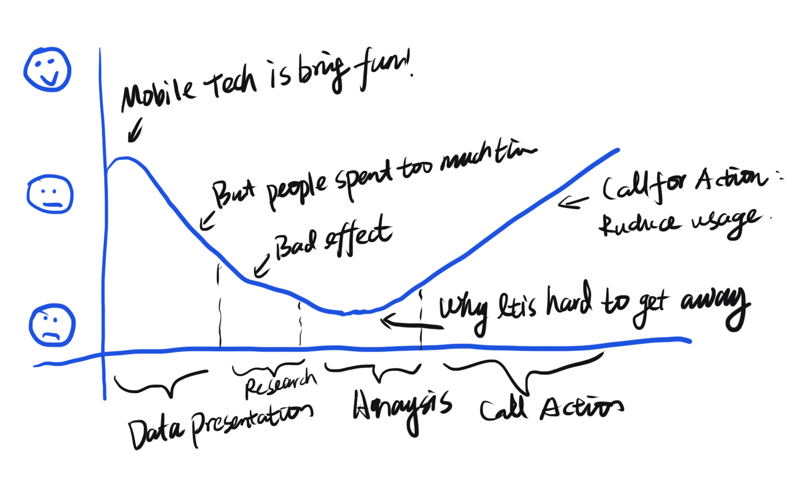
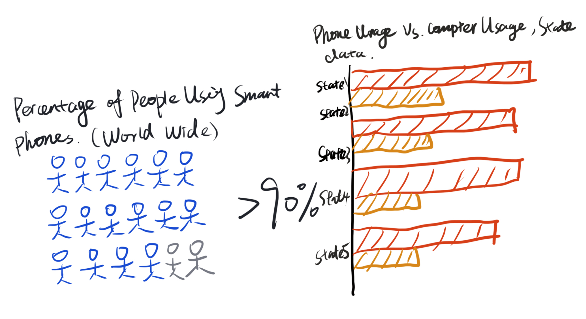
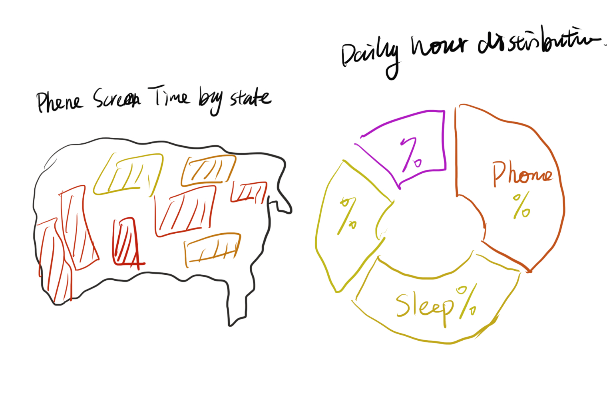

# Final Project, Part 1

## Outline
### Summary
Mobile technology is designed to steal people's time, but we have to fight on and get away from mobile addiciton. 

### Porject Structire (story line)

The porject starts with talking about the truth that mobile technology is changing out lifestyle and bringing much fun. However, at the same time, people are spending too much time on it. Many research results are all pointing to the negative effect caused by mobile addicition. Then the project will come to the lowest mood part, why is this happening? The technology is used to research on human behaviour and applications are designed in the way people get easily addictied. Finally, I want ot call for action that if you feel like you have the problem, you can follow my advise to get rid of mobile addiction. 

## Initial Sketches

In the left sketch, I want to tell a big portion of population are using smart phones. Use small human character with colors to present the percentage.
In the right sketch, I want ot tell people already use more phones than computers. Use bar graph to compare phone usage vs. computer usage, and list top states.

In the left sketch, I try to give a general idea on how much people from different states use their phones. We can see this is a common problem.
In the right sketch, I try to give a projection on people's daily time disctribution, to see a lot of more than we believe we spend on mobiles.

## Data
Major data sourses (but this list will increase as I found more data):
- [Verizon: Ranking Teens’ Screen Time by State ](https://go.verizon.com/resources/teens-with-the-most-screen-time-per-state/)
- [Statista: Mobile Population](https://www.statista.com/statistics/617136/digital-population-worldwide/)
- [Statista: Media usage](https://www.statista.com/statistics/195140/new-user-generated-content-uploaded-by-users-per-minute/)
- [Statista: Leading iPhone apps in the Apple App Store worldwide in October 2021, by revenue](https://www.statista.com/statistics/271103/top-iphone-apps-worldwide-by-revenue/)
- [Statista: Most popular global mobile messenger apps as of October 2021](https://www.statista.com/statistics/258749/most-popular-global-mobile-messenger-apps/)
- [American Time Use Survey Summary](https://www.bls.gov/tus/a1-2019.pdf)

The data can be download in csv format. Firstly, I will use Excel to process data, if there is calculation need, that would be done with Excel. Then the cleaned, formated data will be input to Flourish or Tableau, then produce the graph. Finally, the graph will be inserted to the Shorthand site at the proper place to facilite story.

The mobile population data will be used to compared with world population. Teens'screen time will be uesd to produce country map visulaization (described in sketch). American Time Use Survey Summary will be used to produce daily time usage projection. I will keep searching for data about mobile usage by applicaiton or application category. 

## Method and Platform

I will use Shorthand as my working flatform for my final project. Flourish and Tableau will be used for data visulization production. In case of some graph is not support by Flourish or Tableau, other online tools will be considered.

[Back to Main](/README.md)
